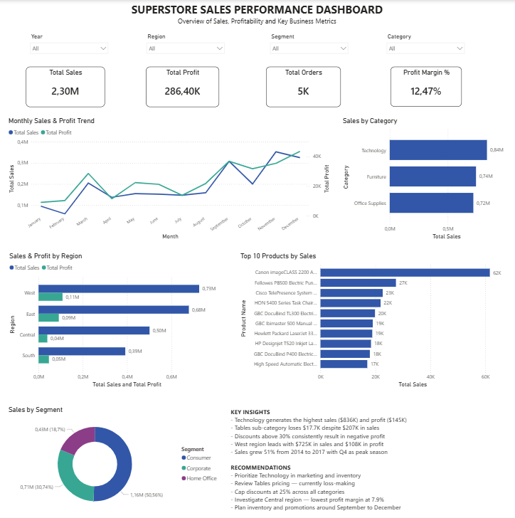
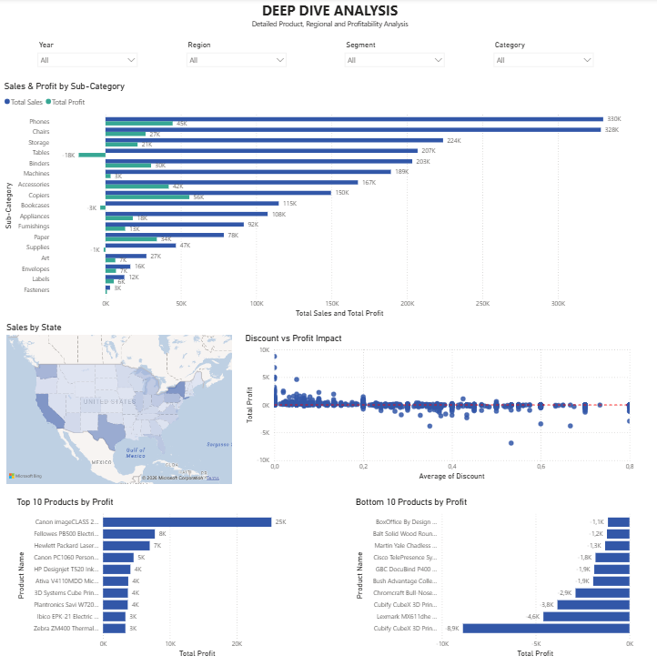

# 📊 Business Sales Performance Analytics

## 📌 Overview
This project was completed as part of the Future Interns Data Science & Analytics Internship.
The objective was to analyze business sales data to identify revenue trends, top-performing 
products, profitable categories, regional performance, and opportunities for business growth.

The analysis was performed using Python for data cleaning and exploratory data analysis (EDA), 
and Power BI for dashboard development and business reporting.

## 🛠️ Tools & Technologies
- 🐍 **Python** — Data cleaning, exploration and analysis
  - 🧮 Pandas — Data manipulation and aggregation
  - 📊 Matplotlib — Data visualization
  - 📈 Seaborn — Statistical visualizations
- 📊 **Power BI** — Interactive dashboard development
- 📓 **Jupyter Notebook** — Analysis environment
- 🐙 **GitHub** — Version control and project documentation

## 📂 Dataset
- 📦 **Name:** Superstore Sales Dataset
- 🌐 **Source:** Kaggle
- 📊 **Records:** 9,994 rows × 21 columns
- 📅 **Period:** 2014 – 2017
- 🧾 **Features:** Orders, customers, products, categories, regions, sales, profit and discount data
- 🔗 **Dataset Link:** https://www.kaggle.com/datasets/vivek468/superstore-dataset-final

## 📁 Project Structure
```text
FUTURE_DS_01/
│
├── data/
│   ├── Sample - Superstore.csv            # Original dataset
│   └── superstore_cleaned.csv             # Cleaned dataset
│
├── notebooks/
│   └── Superstore_Sales_Analysis.ipynb    # Data cleaning, EDA, and insights
│
├── dashboard/
│   └── Superstore_Sales_Dashboard.pbix    # Power BI dashboard
│
├── images/
│   ├── page1_executive_dashboard.png      # Executive Dashboard
│   └── page2_deep_dive_analysis.png       # Deep Dive Analysis Dashboard
│
└── README.md
```

## 📊 Key Findings

- 💻 Technology is the most profitable category, generating $836K in sales and $145K in profit, with a strong 17.4% profit margin.
- 🪑 The Tables sub-category is a major concern, recording $207K in sales but a loss of $17.7K, making it a critical loss-driving product line.
- 💸 High discounts (above 30%) consistently lead to negative profit, with 50% discounts resulting in an average loss of -$310 per transaction.
- 🌍 The West region is the strongest performer, leading in both sales ($725K) and profit ($108K).
- ⚠️ The Central region underperforms, showing a weak profit margin of 7.9% despite generating $501K in sales.
- 📍 At a state level, California and New York are the top-performing states in terms of profitability and sales.
- 📉 Texas shows a concerning trend, generating $170K in sales but a loss of $25.7K in profit.
- 📈 Overall sales increased by 51% between 2014 and 2017, with Q4 consistently being the peak sales season each year.
- 🏠 The Home Office segment delivers the highest profit margin (14%), despite being the smallest customer segment.

## 📊 Dashboard

The Power BI dashboard consists of two pages:

### 📌 Page 1 — Executive Dashboard
An overview designed for business owners and executives, featuring KPI cards, 
sales trends, category and regional performance, top products and key insights.



### 🔍 Page 2 — Deep Dive Analysis
A detailed analytical view covering sub-category performance, state-level sales, 
discount impact on profit, and top and bottom performing products.



## ▶️ How to Run the Notebook

1. 📥 Clone this repository or download the project files locally
2. 🐍 Ensure Python is installed, along with the required libraries:
   - `pandas`
   - `matplotlib`
   - `seaborn`
3. 📓 Open `notebooks/Superstore_Sales_Analysis.ipynb` in Jupyter Notebook
4. ▶️ Run all cells sequentially from top to bottom
5. 💾 The cleaned dataset will be automatically exported to `data/superstore_cleaned.csv`
6. 📊 Open the Power BI dashboard file in Power BI Desktop: `dashboard/Superstore_Sales_Dashboard.pbix`

## 👤 Author

**Ngcebo Enock Mntungwa**
📊 Data Science & Analytics Intern — Future Interns

🔗 [LinkedIn](https://www.linkedin.com/in/enock-mntungwa-803534227)

🐙 [GitHub](https://github.com/John31615/)

